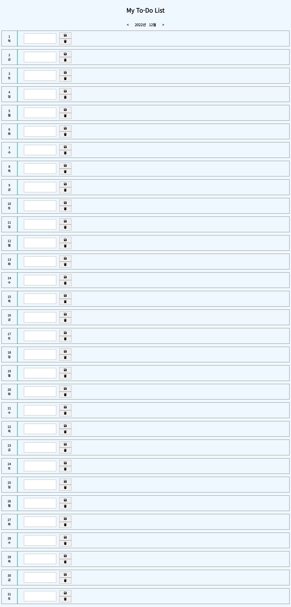

# TODO 리스트 만들기
- todo리스트 만들기
- 요구사항
    - 디자인은(css) 적당히 .. 알아서 만들기
    - 일자별로 todo(할일) 등록할 수 있습니다.
    - 등록된 item은 삭제 할 수 있습니다.
    - 일 단위로 등록된 아이템은 모두 삭제 가능 합니다.
    - 브라우저를 닫고 다시 접속해도 등록한 todo(할일) 유지되어야 합니다.
    - html , css, js 파일을 분리합니다.
    - (월)단위로 관리 합니다.
- optional
    - 월,화,수,목,금,토,일  요일 표시하기
    - 색상변경
        - 토요일 :파랑
        - 일요일 : 빨강
        - 평일은 : 검정
    - 전체 데이터 초기화 기능
        - 해당 월의 모든 todo 데이터를  초기화 합니다.

 
 
 

# 결과물
