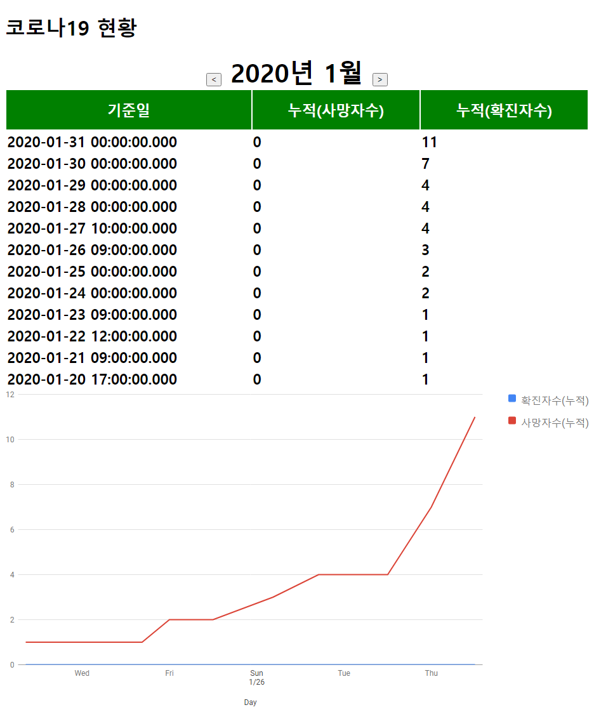

# 코로나19 현황
- 일자별 코로나 확진현황 구하기
    - 관련 api
      - https://www.data.go.kr/tcs/dss/selectApiDataDetailView.do?publicDataPk=15043376
    - 기준일(생성일)
    - 누적(확진자수)
    - 누적(사망자수)
    - 업데이트
    - 그래프 ( chartjs 또는 google chart를 이용해서 구현 합니다. )
        - https://www.chartjs.org/
        - https://developers.google.com/chart
    - 해당 api의 인증키는 아래 링크를 클릭하여 확인합니다.
        - https://www.data.go.kr/iim/api/selectApiKeyList.do

 

- 이전(달), 다음(달) 이동할 수 있도록 구현해 주세요.
    - 미래의 달은 이동할 수 없습니다.
        - ex) 오늘이 10.01이라면 11월은 이동버튼을 disable 처리 합니다.

 
 
 

# 결과물
