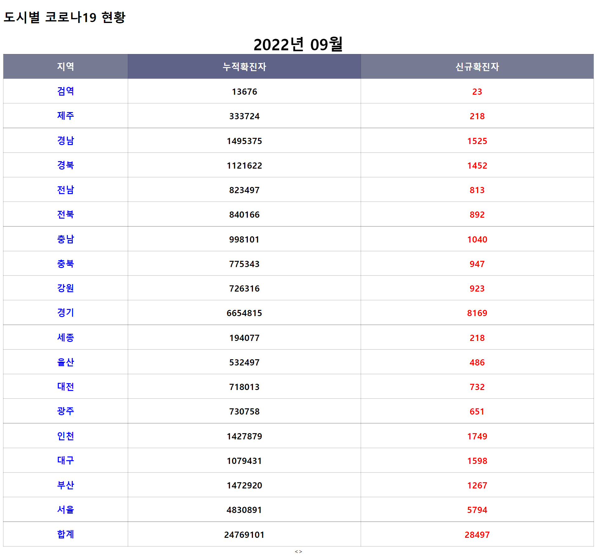

# 코로나 도시발생 현황
- 구현 형식은 자유
- 관련 api
    - https://www.data.go.kr/data/15043378/openapi.do
- 아래 ui를 참고해주세요(출처 : naver)
- 페이징 구현하기
- 해당 도시를 클릭하면 9월달 동안의 코로나 현황을 조회 할 수 있는 페이지로 이동 후 2022.09.01 ~ 09.31까지 현황을 조회합니다.
- 팝업 또는 새로운 창으로 이동합니다.
- 신규확진자 현황은 api에서 제공해주지 않는다면 구현할 필요 없습니다.

 
 
 

# 결과물
