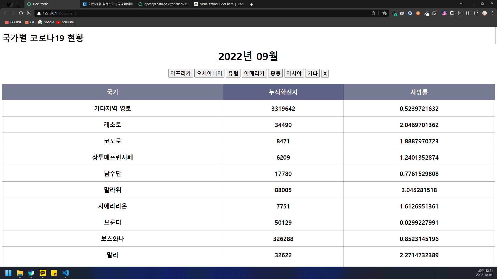

# 전세계의 코로나 19 현황
- 구현 형식은 자유
    - 코로나 19 현황을 참고하여 구현해 주세요
    - 신규확진자 현황은 api에서 제공하지 않는다면 구현하지 않습니다.
    - 관련 api
        - https://www.data.go.kr/data/15043379/openapi.do
    - 아래 ui를 참고해주세요(출처 : naver)
    - 대륙별 페이징 처리 구현
    - 해당 국가를 클릭하면 2022.09.01 ~ 09.31까지의 현황을 조회합니다.
      - 팝업 또는 새로운 창으로 이동합니다.
    - chart. : google region chart를 이용해서 구현합니다.
        - https://developers.google.com/chart/interactive/docs/gallery/geochart
        - 구현시 예외상황이 발생할 수 있습니다. 최대한 해결해보세요!

 
 
 

# 결과물
