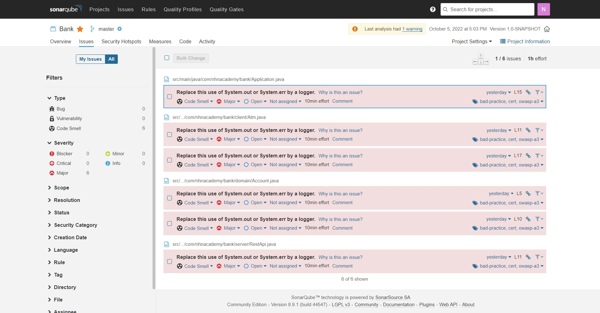

# IntelliJ Learn IDE Features for Java Lesson 따라하기
```
- git & github 교육 이후에 직접 따라해보기
- 전체 항목 체크된 스크린샷 제출
```
- git
- Quick start
- Project history
- Commit
- Feature branch workflow
- Interactive rebase
- Changelists and shelf
- Annotate with Git Blame

# CheckStyle, SonarLint Plugin 적용해보기
- 이슈 없게 만들기 (logger이슈 제외)

<br/>
<br/>
<br/>

# 결과물
## IntelliJ Learn IDE Features for Java Lesson 따라하기


## CheckStyle, SonarLint Plugin 적용해보기
