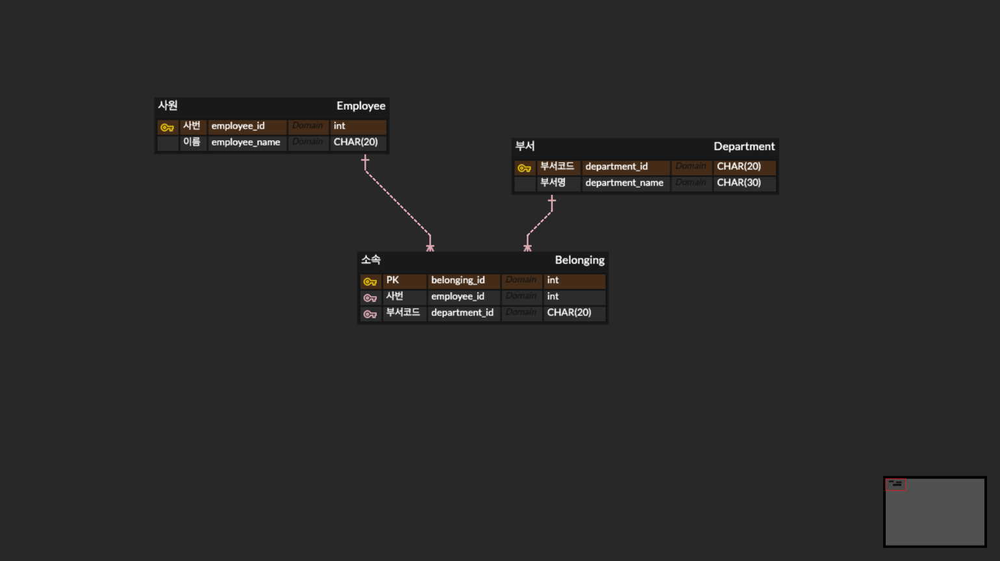

## 준비 사항
- Jdk11
- MySQL 접속 툴

## 과제 설명 개요
- 개요을 잘 읽고 문제를 해결해주세요.
- 여러분들은 다음과 같은 조직 정보(department.txt) 를 데이터 베이스에 로딩합니다. 애플리케이션이 시작할때마다 매번 로딩합니다.
- 로딩한 데이터를 사용하여, 사용자 요청에 적합한 데이터를 응답할 할 수 있는 REST-API 애플리케이션을 만들어야 합니다.
- OOP 를 기반으로 클래스를 설계하시고, 가독성있고 견고한 애플리케이션을 작성해야 합니다.
- 애플리케이션의 모든 기능들은 스프링 빈으로 구현하셔야 합니다.
- 조직정보를 의미하는 파일 department.txt의 내용은 다음과 같습니다.
    - department.txt 에는 최대 1000 라인까지만 존재합니다.
    - 사원은 같은 이름이 존재할 수 있습니다.
    - 부서는 같은 이름이 존재할 수 있습니다.
    - 사원은 여러 부서에 포함될 수 있습니다.
    - 부서는 여러 사원을 포함할 수 있습니다.

|사번             |이름             | 부서            |부서 코드          |
|----------------|----------------|----------------|----------------|
|20202201        |김이름            | 백엔드1팀        |L1001           |
|20202202        |김이름            | 백엔드2팀        |L1002           |
|20202201        |김이름            | 백엔드3팀        |L1003           |
|20202201        |김이름            | 백엔드4팀        |L1004           |
|20202202        |김이름            | 백엔드5팀        |L1005           |
|20202202        |김이름            | 백엔드1팀        |L1001           |

## 요구 사항
- maven 으로 프로젝트를 만듭니다.
```
$ java -Dinit.file.name=/home/user/department.txt -jar application.jar
```
- init.file.name은 파일 경로 이름입니다.
    - 다음과 같이 실행하면 파일을 로딩하고, REST-API를 실행할 수 있는 웹 서버가 기동되어야 합니다.
- '과제 설명 개요' 의 department.txt 를 보고 테이블을 설계합니다.
    - 관계형 데이터 베이스이므로 테이블 정규화 과정을 거쳐 테이블을 설계해야만 합니다.
    - create table 구문은 ddl.sql 파일과 ERD 이미지 파일을 별도 제출하세요.
- 애플리케이션을 실행하면 init.file.name경로에 있는 파일을 읽고 파싱한 뒤 데이터베이스에 새로 저장합니다.
    - init.file.name변수에 값이 없으면 애플리케이션은 초기화 과정없이 실행되어야 합니다.
    - 애플리케이션을 실행할 때마다 데이터 베이스에 저장된 데이터는 삭제 및 초기화 해야합니다.
    - 영속성 관련 작업은 반드시 JPA 를 사용하여 데이터를 처리해야 합니다.
    - JPA 가 실행한 쿼리가 로그(콘솔)에 남도록 설정하세요.
- 애플리케이션은 예외 상황에 대해서 적절히 대응할 수 있어야 합니다.
- DataSource 에서 커넥션을 획득할 때, select 1 쿼리를 사용하여 커넥션 객체를 검증해야 합니다.
- 다음 API 를 개발합니다.
```
GET /department-members?departmentIds=L1001,{부서 코드}
Accept: application/json

HTTP/1.1 200 OK
[{
    "department": {
        "id": "L1001",    // 부서 코드
        "name": "백엔드1팀"
    },
    "employee": {
        "id": "20202201",   // 사번
        "name": "김이름"
    }
},{
    ...
}]
```

- API 요구 사항
    - 응답 객체들의 순서는 department.txt 파일의 부서코드, 사번 순서(ASC)입니다.
- 부서를 구분할 수 있는 구분자를 파라미터로 전달하면 부서에 포함된 모든 사용자를 응답합니다.
- 파라미터 departmentIds는 반드시 한개 이상 존재해야 합니다.
    - 파라미터 departmentIds가 없으면 'HTTP/1.1 400 Bad Request' 를 응답합니다.
- Accept 헤더는 반드시 필요합니다.
    - Accept: application/json 가 아니면 'HTTP/1.1 400 Bad Request' 를 응답합니다.
- TEST 케이스를 작성하여 200 ok, 400 Bad request, 401 Unauthorized 를 확인해야 합니다.
    - 단 컨트롤러 클래스의 유닛테스트이며, 컨트롤러 클래스의 기능만 한정하여 테스트 합니다.

## 제출해야할 것
- 실행가능한 jar 파일
- 소스코드를 묶은 zip 파일
    - ddl.sql 포함할 것
    - ER-diagram 이미지도 포함할 것

<br/>
<br/>
<br/>

# 결과물
- ERD
